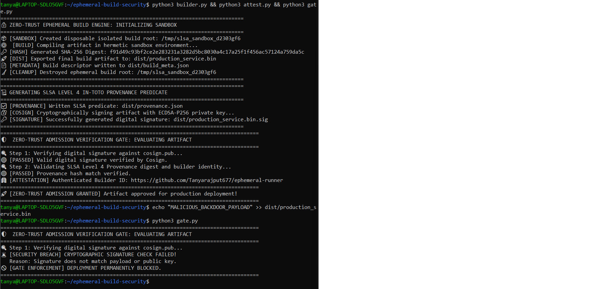

#  Zero-Trust & SLSA-Compliant Ephemeral Build Infrastructure

[](https://opensource.org/licenses/MIT)
[](https://slsa.dev)
[](https://sigstore.dev)
[](https://ubuntu.com/)

A software supply chain security and zero-trust build platform implementing **SLSA (Supply-chain Levels for Software Artifacts) Level 4** provenance generation, **Sigstore/Cosign** cryptographic artifact signing, and automated admission gate verification.

---

##  Live Zero-Trust Enforcement & Tamper Defense Demo

Below is the live execution trace showing successful cryptographic provenance admission verification followed by real-time rejection of a tampered binary:



---

##  Problem Statement: Software Supply Chain Vulnerabilities

Modern CI/CD environments (e.g., persistent shared runners in Jenkins or standard worker pools) are vulnerable to persistent runner poisoning, unauthorized dependency injection, and post-build binary modification (e.g., *SolarWinds*, *Codecov* breaches).

- **Runner Persistence:** Attackers compromise shared runners to tamper with subsequent builds.
- **Unverified Provenance:** Artifacts lack machine-readable, cryptographic proofs detailing *who*, *when*, and *from what exact commit* a binary was created.
- **Unsigned Workloads:** Deployment runtimes execute binaries without verifying integrity signatures against trusted identities.

---

##  Solution Architecture: End-to-End Zero-Trust Pipeline

This platform implements a zero-trust model where no build runner is trusted beyond the lifecycle of a single compilation step:

```text
+-----------------------------------------------------------------------------------+
|                           ZERO-TRUST CI/CD WORKSPACE                              |
|                                                                                   |
|  [Source Code] ──► [Ephemeral Sandboxed Builder] ──► [Unsigned Artifact + SHA256] |
|                                                               │                   |
+───────────────────────────────────────────────────────────────┼───────────────────+
|                           SECURITY ATTESTATION LAYER          │                   |
|                                                               ▼                   |
|  [SLSA In-Toto Provenance Generator] ◄────────────────────────┘                   |
|        │                                                                          |
|        ▼                                                                          |
|  [Cosign ECDSA-P256 Key Engine] ────► [Cryptographically Signed Attestation]      |
|                                                       │                           |
|                                                       ▼                           |
|                                     [Zero-Trust Admission Gate]                   |
|                                     ├─ 🟢 Valid Sig & Provenance ─► Release       |
|                                     └─ 🔴 Tampered / Untrusted  ─► Block Deploy   |
+-----------------------------------------------------------------------------------+

## Repository Structure
├── builder.py          # Ephemeral runner provisioning & hermetic compilation engine
├── attest.py           # SLSA Level 4 in-toto provenance generator & Cosign signer
├── gate.py             # Zero-trust admission verification gatekeeper
├── cosign.pub          # Public verification key for artifact admission
├── dist/               # Compiled binaries, signatures (.sig), and provenance predicates
├── LICENSE             # MIT Open Source License
└── README.md           # Technical architecture documentation